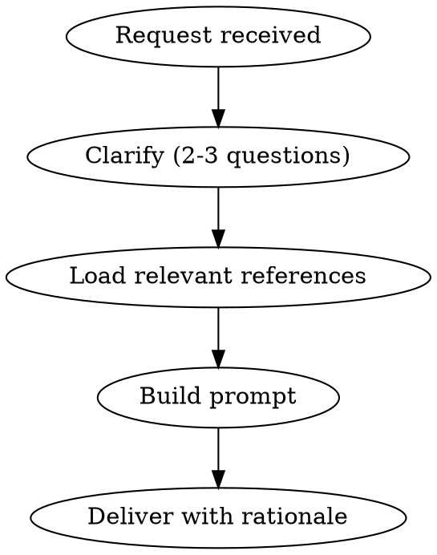

# Meta Prompt Creator

## Overview

Systematically build effective prompts through targeted clarification before writing. Never produce a prompt with placeholder brackets or invented conventions.

## Process

### Step 1 — Clarify (always, even if request seems clear)

Ask exactly these when unknown:
- **Model**: Claude, GPT-4o, o1, other?
- **Task**: What should the model produce? (code, text, analysis, structured data?)
- **Output format**: Plain text, JSON, markdown, specific structure?
- **Context available**: Will the user paste content, or is it a standalone prompt?

Max 3 questions. Don't ask what you can reasonably infer.

### Step 2 — Load references

| Need | Reference file |
|------|---------------|
| Targeting Claude | @references/anthropic-best-practices.md |
| Targeting GPT/o-series | @references/openai-best-practices.md |
| Structuring with XML | @references/xml-structure.md |
| Adding examples | @references/few-shot-patterns.md |
| Eliciting reasoning | @references/reasoning-techniques.md |
| Writing system prompt | @references/system-prompt-patterns.md |
| Avoiding vagueness | @references/clarity-principles.md |
| Managing long context | @references/context-management.md |
| Reusable task types | @references/prompt-templates.md |
| Checking quality | @references/anti-patterns.md |

### Step 3 — Build

Structure every prompt with:
1. **Role** (if beneficial) — what the model is
2. **Task** — what to do, imperative and specific
3. **Context** — what the model needs to know
4. **Constraints** — what to avoid or limit
5. **Output format** — exact format expected

### Step 4 — Deliver

- Output the prompt in a code block (ready to copy-paste)
- Add 3-5 bullet points explaining key choices
- Offer one follow-up: "Want me to adjust X?"

## Red Flags — STOP

- About to write `[placeholder]` brackets → ask instead
- About to invent a convention (format, style) → ask instead
- Skipping clarification because "request is clear enough" → ask anyway
- Writing more than 3 clarifying questions → trim

## Common Mistakes

| Mistake | Fix |
|---------|-----|
| Generic template with brackets | Ask the missing info upfront |
| Invented conventions | Validate with user before applying |
| Prompt too long | One instruction per sentence, cut fluff |
| No output format specified | Always define expected format explicitly |
| Same prompt for all models | Load model-specific reference first |
